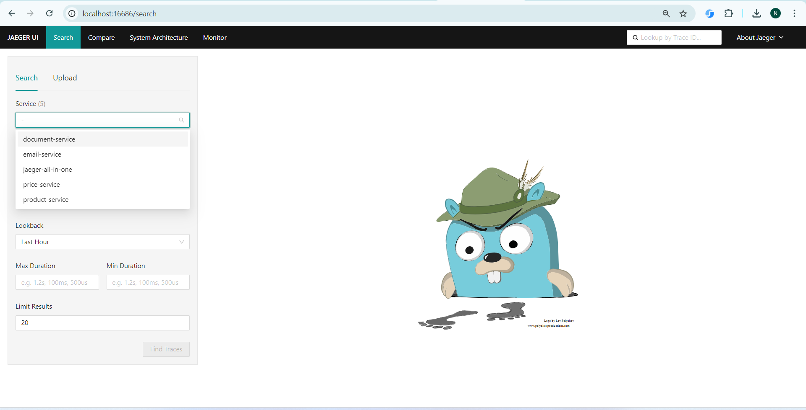

# Observability with OpenTelemetry: Multi-Microservice Project

## Overview
Observability is crucial in a multi-microservice architecture to ensure that the system’s health 
and performance are comprehensively monitored. OpenTelemetry provides a set of APIs, libraries, 
agents, and instrumentation for collecting distributed traces, metrics, and logs from applications. 
By integrating OpenTelemetry into your multi-microservice project, you gain visibility into how 
different services interact, identify bottlenecks, and troubleshoot issues efficiently.

## Key Features
- **Distributed Tracing**: Track the flow of requests across various microservices to diagnose performance bottlenecks and troubleshoot issues.
- **Metrics Collection**: Gather and visualize metrics to monitor the health and performance of each microservice.
- **Logging Integration**: Correlate logs with traces and metrics for a complete view of your system’s behavior.
- **Automatic Data Capture**: Utilize auto-instrumentation libraries to automatically capture telemetry data from common libraries and frameworks without manual coding.
- **Flexible Configuration**: Configure which parts of the application are instrumented, allowing for custom and optimized telemetry collection
- **Backend Compatibility**: Seamlessly integrate with popular observability backends such as Jaeger, Prometheus, Grafana, and others for data visualization and analysis.
- **Trace Context**: Ensure that context (e.g., trace and span IDs) is consistently propagated across service boundaries, maintaining a coherent view of distributed traces.
- **Correlation IDs**: Use correlation IDs to link logs, traces, and metrics, facilitating unified tracking of requests across microservices.
- **Custom Spans and Metrics**: Create and manage custom spans and metrics tailored to your application's specific needs and business logic.
- **Granular Insights**: Gain detailed insights into specific operations and service interactions by instrumenting key functions and endpoints.
- **Bottleneck Identification**: Quickly identify performance bottlenecks and service dependencies through comprehensive tracing and metrics.
- **Anomaly Detection**: Monitor and detect anomalies in real-time, improving the ability to respond to potential issues before they impact users.
- **Minimal Code Changes**: Integrate OpenTelemetry with minimal changes to your existing codebase, leveraging existing libraries and frameworks.
- **Comprehensive Documentation**: Access extensive documentation and community support to guide the implementation and troubleshooting processes.


## Project Structure

- **document-service**: Handles document-related operations.
- **email-microservice**: Manages email sending and notifications.
- **spring-cloud-open-telemetry-1**: Contains setups for product service using Spring Cloud with OpenTelemetry.
- **spring-cloud-open-telemetry-2**: Contains setups for price service using Spring Cloud with OpenTelemetry.
- **jaegertracing/all-in-one**: Contains sample working code using Spring Cloud with OpenTelemetry.

## Prerequisites

- **JDK 11 or above**
- **Maven 3.x**
- **Docker** (for running the Docker setup)
- **Spring Boot 2.5.x** compatible versions
- **PostgreSQL** or **H2** (for testing)

## How to Build the Project

1. Clone this repository:
    ```bash
    git clone <repository-url>
    cd observability-with-opentelemetry
    ```

2. Build the project using Maven:
    ```bash
    mvn clean package
    ```

## Accessing the H2 Console (for testing)
- The H2 Console is available at http://localhost:8080/h2-console.
- Default credentials are:

  - Username: sa
  - Password: (leave blank)
  
## Observability with OpenTelemetry
  - The project integrates OpenTelemetry for distributed tracing.
  - Make sure the `otel-config.yml` file is correctly configured in each service for tracing.

## Troubleshooting
  - **Port Conflicts**: Ensure no other application is running on the configured ports.
  - **Dependency Issues**: Ensure all dependencies are compatible with Spring Boot 2.5.x.

## Running the Services

Each microservice can be started individually using the following commands:

### Document Service

1. Navigate to the `document-service` directory.
2. Run the service using:
    ```bash
    java -jar target/document-service-1.0.0-SNAPSHOT.jar
    ```
   or
    ```bash
    mvn spring-boot:run
    ```

### Email Microservice

1. Navigate to the `email-microservice` directory.
2. Run the service using:
    ```bash
    java -jar target/email-microservice-1.0.0-SNAPSHOT.jar
    ```
   or
    ```bash
    mvn spring-boot:run
    ```

## Running with Docker

To run all services together using Docker, use the provided `docker-compose.yml`:

```bash
docker-compose up
```

## Sample Local Testing

You can see all services is registered with Jaeger Service.



### Note: To get register respective service, we need to trigger at least one API endpoint.
